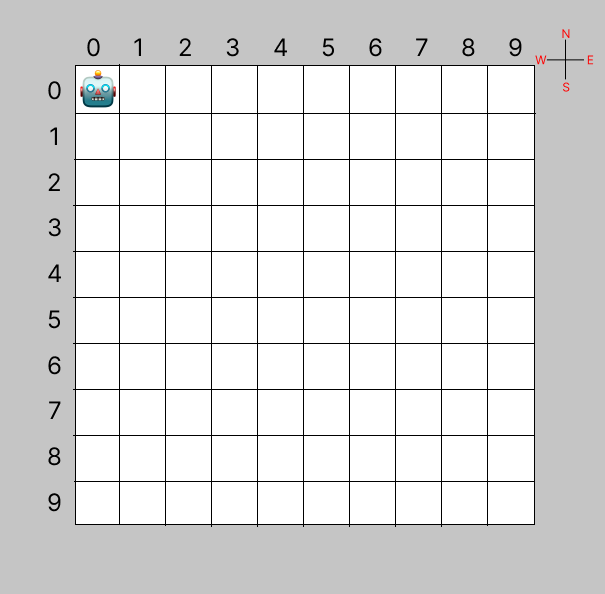

# Warehouse Robot

The Warehouse Robot Application is a fun and interactive Node.js command-line program that allows users to control a robot moving around a 10x10 grid in a warehouse. The robot can perform various movements based on user input.
  
## Getting Started

1. Make sure you have Node.js installed on your machine.
2. Clone this repository to your local machine.
3. Install the required dependencies by running: `npm install`

## How to Use

1. Navigate to the project directory in your terminal or command prompt.
2. To start the Warehouse Robot Application, run the following command: `node robot`.
3. Follow the on-screen instructions to control the robot. Type the single capital letters for each command, separated by spaces, and press ENTER to execute.

Available commands:

- `N`: Move the robot North.
- `W`: Move the robot West.
- `E`: Move the robot East.
- `S`: Move the robot South.

- `Q`: Quit the application and exit.

## Notes

- The robot can currently move across the warehouse grid in four directions: North (N), West (W), East (E) and South (S).
- It can also take directions separated by spaces e.g. "S E N W" will move the robot in a square motion.

## Testing

- The application uses Jest for unit testing.
- To run the tests, use `npm run test` command.
- To see the test coverage, use `npm run coverage` command.
